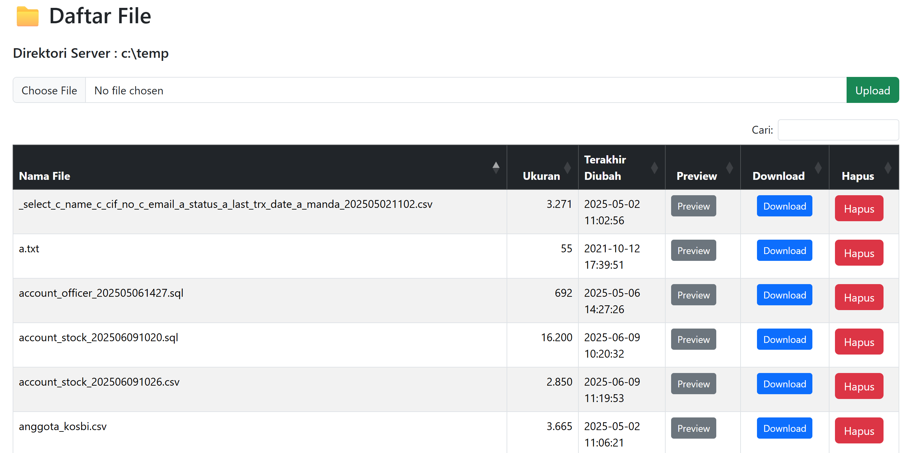

# SFTP-Project
Building SFTP Server using Java Spring Boot

[](https://ko-fi.com/ytirta)


# 📁 SFTP Web Interface with Spring Boot & Thymeleaf

This project is a simple yet functional web-based SFTP interface built using **Spring Boot** and **Thymeleaf**. It provides a clean starting point for secure file operations over SFTP within a web application.

## ✨ Features

- 🔐 Secure access using **Spring Security**
- 📂 Browse server-side folders and view file lists
- 📄 Each file includes action icons:
  - **Delete**
  - **Preview**
  - **Download**
- ⬆️ Upload button for adding new files (placed outside the file grid)
- Secure access directly to the folder using SFTP protocol at a configured port (in this example using port 2222)
  - Use SFTP Client software to test this feature such as FileZila or WinSCP
  - Build another project as SFTP Client to manage the SFTP Server folders locally and securely. This project can be integrated with your application as per your requirement.

## 🛠️ Tech Stack

- **Backend**: Java + Spring Boot
- **Frontend**: Thymeleaf templating engine
- **Security**: Spring Security (basic authentication or custom login)

## 📦 Getting Started

1. Clone this repository:

   ```bash
   git clone https://github.com/YaniTirta/sftp-server-springboot.git

2. Build and run:
   ./mvnw spring-boot:run
   
3. Access the app at http://localhost:8080
4. Access using SFTP Tools such as FileZila or WinScp
   Credential :
     user      : user1
     password  : pass123

Folder structure: 


Main interface of the SFTP Web application:





License :
This project is shared openly to support learning and development. Feel free to fork and enhance it. See LICENSE file for details.


[](https://buymeacoffee.com/ytirta)

## 🙌 Dukungan / Support

Jika proyek ini bermanfaat, pertimbangkan untuk mendukung saya:
[](https://ko-fi.com/ytirta)

Dukungan Anda membantu saya untuk terus mengembangkan open-source, menulis dokumentasi bilingual, dan berbagi solusi yang real-world friendly. Terima kasih! 🙏

📘 [Dapatkan versi e-book di sini](https://lynk.id/ytirta/o1054g1w0ypq)


