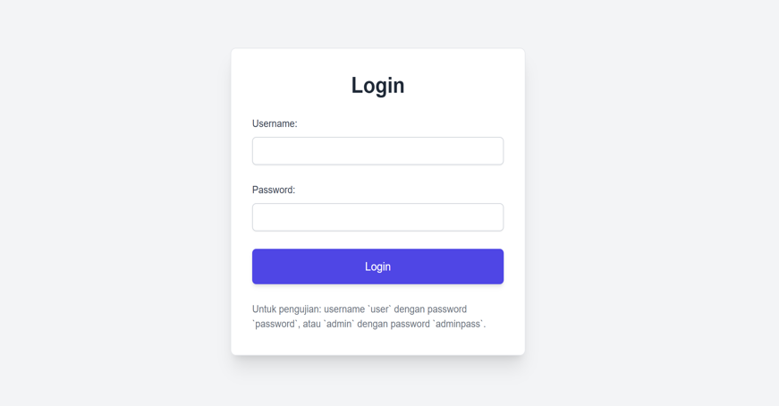

# SFTP-Project
Building SFTP Server using Java Spring Boot

[](https://ko-fi.com/ytirta)


# 📁 SFTP Web Interface with Spring Boot & Thymeleaf

This project is a simple yet functional web-based SFTP Server application built using **Spring Boot** and **Thymeleaf**. It provides a clean starting point for secure file operations over SFTP within a web application.

## ✨ Features

- 🔐 Secure access using **Spring Security**
- 📂 Browse server-side folders and view file lists
- 📄 Each file includes action icons:
  - **Delete**
  - **Preview**
  - **Download**
- ⬆️ Upload button for adding new files (placed outside the file grid)
- Secure access directly to the folder using SFTP protocol at a configured port (in this example using port 2222). This file server feature with SFTP protocol access can be managed using available open source software or by building your own client application for this need.
  - Use SFTP Client software to test this feature such as using FileZila or WinSCP
  - Build another project such as SFTP Client application to manage the SFTP Server folders locally and securely. This project can be integrated with your application as per your requirement. (Feel free to message me if you need further assistance regarding this feature)

## 🛠️ Tech Stack

- **Backend**: Java + Spring Boot
- **Frontend**: Thymeleaf templating engine
- **Security**: Spring Security (basic authentication or custom login)
- **SFTP Server Module**: Apache MINA project

## 📦 Getting Started

1. Clone this repository:

   ```bash
   git clone https://github.com/YaniTirta/sftp-server-springboot.git

2. Build and run:
   ./mvnw spring-boot:run
   
3. Access the app at http://localhost:8080
4. Access using SFTP Tools such as FileZila or WinScp
   Credential :
     user      : user1
     password  : pass123

Folder structure: 


Main interface of the SFTP Web application:




License :
This project is shared openly to help those of you who need your own SFTP Server module. It can be used as a stand-alone application to manage or backup your important files safely on the server or integrated with other existing applications.
See the LICENCE file for details.


## 🙌 Support 

If this project is useful for you, please consider supporting me: 
[](https://ko-fi.com/ytirta)

📘 [Get e-book version here.. ](https://lynk.id/ytirta/zg5e01eg313j)

Untuk anda yang berlokasi di Indonesia, dukung saya disini:
[](https://trakteer.id/ytirta)

Your support helps me to continue developing open-source, writing bilingual documentation, and sharing real-world friendly solutions. Thank you! 🙏

📘 [Dapatkan e-book nya disini.. ](https://lynk.id/ytirta/o1054g1w0ypq)


