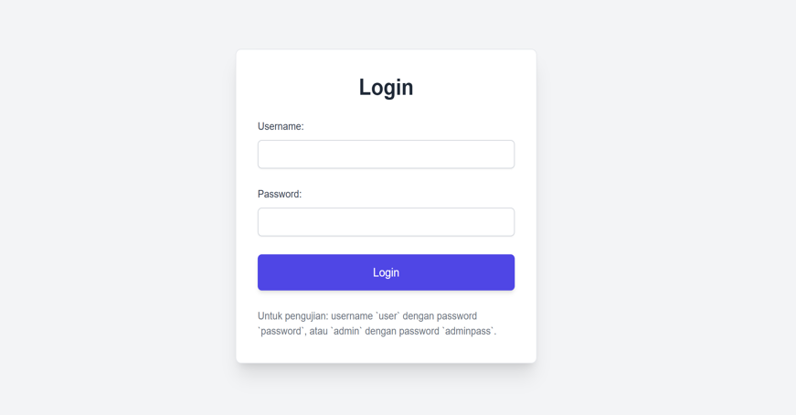
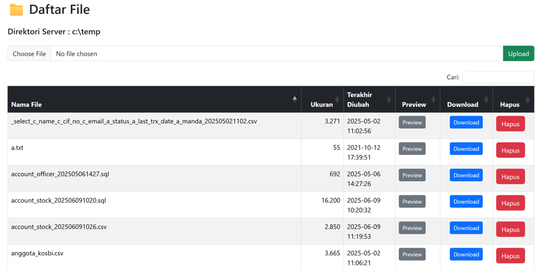

# SFTP-Project
Membangun SFTP Server menggunakan Java Spring Boot

# 📁 Antar muka SFTP Web dengan Spring Boot & Thymeleaf

Proyek ini adalah mengembangkan SFTP Server berbasis web yang dapat langsung digunakan dan fungsional yang dibuat menggunakan **Spring Boot** dan **Thymeleaf**. Dapat dijadikan sebagai titik awal untuk operasi pengelolaan file di server yang aman melalui protokol SFTP yang juga menyediakan antar muka web.

## ✨ Fitur yang tersedia

- 🔐 Akses web yang aman menggunakan **Spring Security**
- 📂 Mengelola direktori di server dan melihat daftar file melalui antar muka web
- 📄 Untuk setiap file dapat dilakukan:
  - **Delete / Hapus**
  - **Preview / Lihat**
  - **Download / Unduh**
- ⬆️ Tombol Upload untuk menambah file baru yang ditempatkan diluar grid
- Akses langsung ke folder di server secara aman menggunakan protokol SFTP yang dapat dikonfigurasi di port tertentu (dalam contoh proyek ini di port 2222)
  - Pengaksesan server dapat menggunakan software khusus seperti FileZila atau WinScp
  - Dapat juga membangun project lain sebagai SFTP Client agar dapat diintegrasikan dengan aplikasi lain atau dapat juga berdiri sendiri untuk mengelola folder di server sesuai kebutuhan.

## 🛠️ Teknologi yang digunakan

- **Backend**: Java + Spring Boot
- **Frontend**: Thymeleaf templating engine
- **Security**: Spring Security (basic authentication or custom login)
- **SFTP module**: Apache MINA project

## 📦 Memulai, ikuti langkah berikut
## 📦 Memulai, ikuti langkah berikut

1. Clone repository ini:

   .. bash ..
   git clone https://github.com/YaniTirta/sftp-server-springboot.git
   
   -- dapat juga menggunakan GitHub Desktop

2. Build and run:
   ./mvnw spring-boot:run
   
3. Akses aplikasi di: http://localhost:8080
4. Akses menggunakan SFTP Tool seperti FileZila or WinScp
   Pengamanan :
     user      : user1
     password  : pass123

Struktur folder / paket java: 

Contoh interface aplikasi SFTP Web :

## Licensi :
## 📦 Memulai, ikuti langkah berikut

Proyek ini dibagikan secara terbuka untuk membantu anda yang membutuhkan pegembangan modul SFTP Server. Dapat digunakan sebagai aplikasi yang berdiri sendiri untuk mengelola atau membuat cadangan (backup) file-file penting anda secara aman di server atau diintegrasikan dengan aplikasi lain yang sudah ada.
Lihat file LICENCE untuk detailnya.

## 🙌 Dukungan 

Jika proyek ini bermanfaat bagi Anda, dukungan anda akan sangat berarti:

Dukungan Anda sangat berarti dalam membantu saya untuk terus mengembangkan perangkat lunak open source seperti ini, menulis dokumentasi dwibahasa, dan berbagi solusi yang mudah dipahami. Terima kasih! 🙏

📘 [Dapatkan versi e-book di sini](https://lynk.id/ytirta/o1054g1w0ypq)

